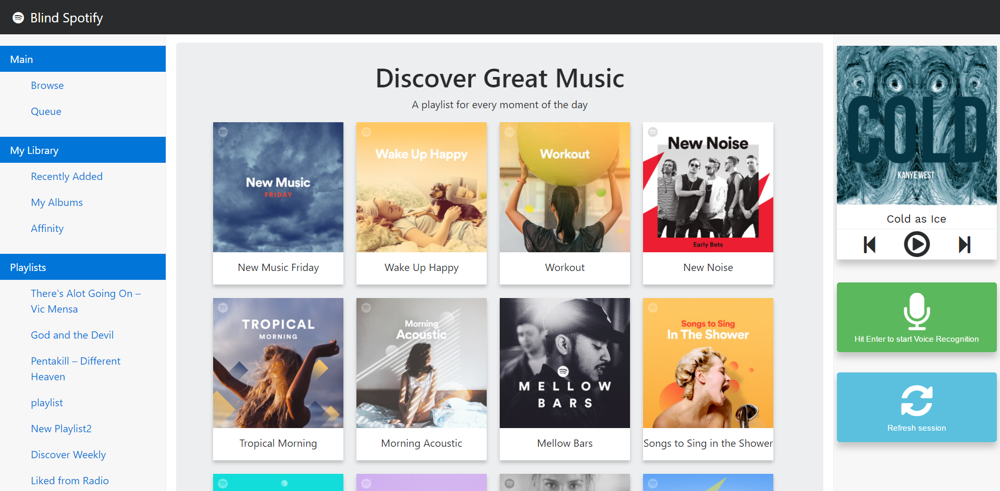

# BlindSpotify

This client adds accessibility features with annyang voice recognition and ResponsiveVoice voice synthesis.  It is built upon the Spotify web API, so tracks are limited to 30 second previews.

# How to set up
First off, install all of the bower components with 
`bower install`
and then install all of the node modules with
`npm install`

To run the server, you simply run `server.js`.  However before you can do that, you must register for an application at Spotify and then replace the CLIENT KEY, CLIENT SECRET, and CALLBACK from the server.js file with your own values.  
